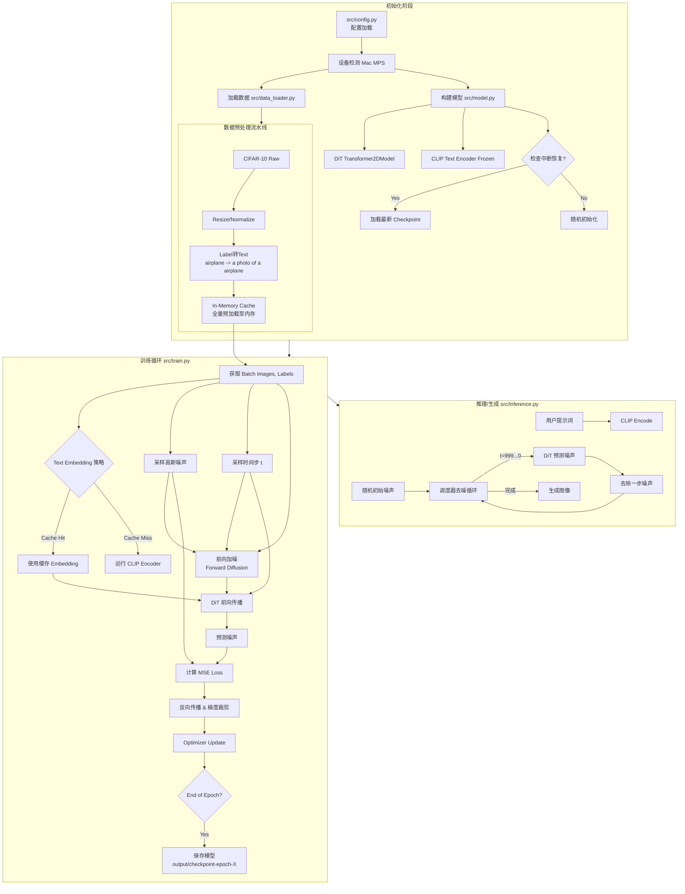

# 项目全流程图解 (Project Workflow)

本文档详细梳理了 `TinyDiT` 项目从数据准备、模型初始化、训练循环到最终推理的完整工作流。

## 1. 整体架构概览 (Mermaid Flowchart)

## 2. 关键流程详解

### A. 数据加速 (Data Acceleration)
为了适配 Mac 的统一内存架构，我们实施了激进的数据优化：
1.  **In-Memory Caching**: 启动时将 60,000 张 CIFAR-10 图片全部解码、处理并存储为 Tensor 放在内存中 (约 700MB)。这消除了训练时的磁盘 IO 和 CPU 预处理开销。
2.  **Text Embedding Caching**: 对于固定类别的 CIFAR-10，我们只计算一次 CLIP Embedding 并缓存。训练时直接查表，不再运行庞大的 CLIP 模型。

### B. 混合精度训练 (Mixed Precision)
虽然配置中支持 `fp16`，但在 Mac MPS 上，为了稳定性我们目前默认使用 `fp32` (或者由 Accelerator 自动管理)。代码中保留了 `accelerator.accumulate` 接口，支持梯度累积。

### C. 断点续传 (Resume)
`src/train.py` 包含自动检测逻辑：
*   检查 `output_dir` 下的 checkpoints。
*   加载最新的权重。
*   自动“快进” DataLoader 和 Scheduler 到对应的步数，确保训练无缝继续。
