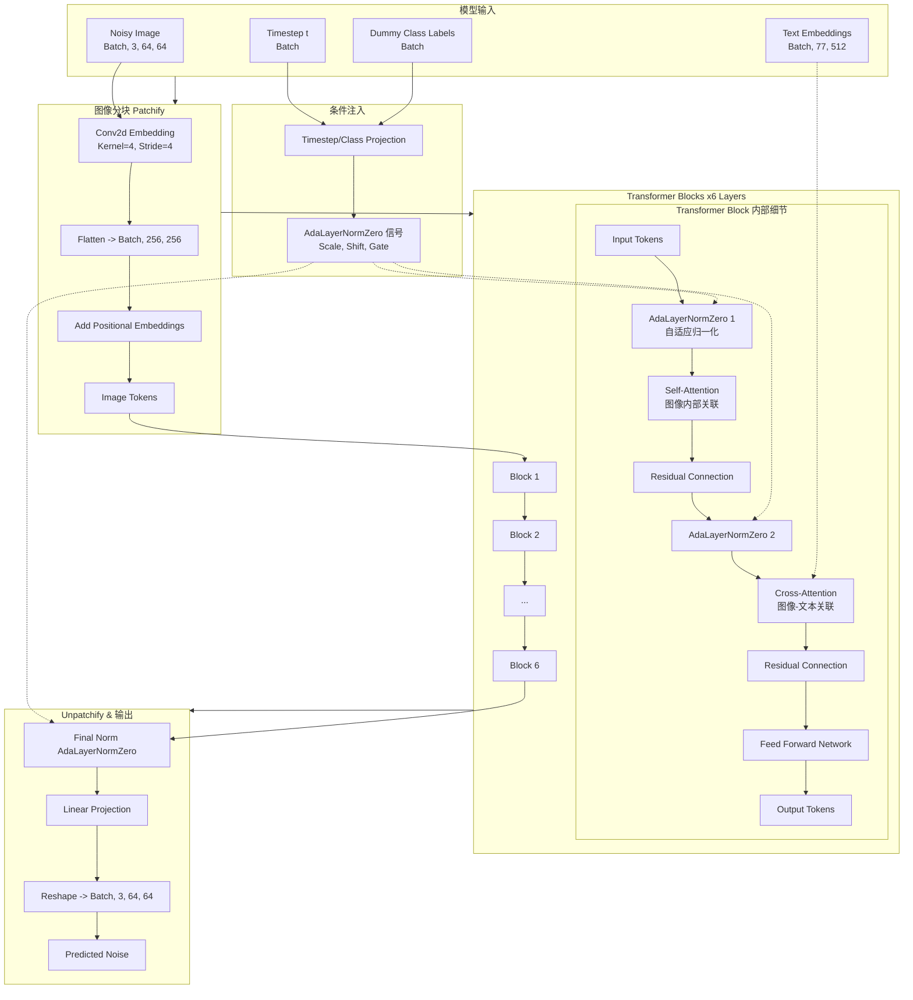

# DiT 模型结构详解 (Model Architecture)

本文档通过图表详细解析本项目中使用的 **TinyDiT** 架构。它基于 `diffusers.Transformer2DModel` 构建，并针对文生图任务进行了适配。

## 1. 核心架构图 (Mermaid Diagram)

## 2. 关键组件解析

### A. Patchify (分块嵌入)
*   **作用**: 将二维图片转换为 Transformer 可以处理的一维序列。
*   **实现**: 使用一个卷积层 (`Conv2d`)，核大小和步长都等于 `patch_size` (4)。
*   **维度变化**: `[B, 3, 64, 64]` -> `[B, 256, 16, 16]` -> Flatten -> `[B, 256, 256]` (序列长度=256, 维度=256)。

### B. AdaLayerNormZero (自适应归一化)
*   **作用**: 这是 DiT 的核心机制。它不使用标准的 LayerNorm，而是根据 **时间步 (t)** 和 **类别 (Class)** 动态生成归一化的参数 (Scale & Shift)。
*   **意义**: 这使得模型知道“现在是第几步扩散过程”，从而控制生成的进度。
*   **Hack**: 由于我们是做文生图，但在使用 `patch_size` 时 `diffusers` 强制要求这种归一化方式，所以我们传入了全 0 的 `dummy_class_labels` 来满足 API 要求，主要依赖时间步信息。

### C. Cross-Attention (交叉注意力)
*   **作用**: 将文本信息注入到图像生成过程中。
*   **机制**:
    *   **Query**: 来自图像的 Tokens。
    *   **Key/Value**: 来自 CLIP 编码的文本 Embeddings (77个 Token)。
*   **结果**: 图像的每个 Patch 都能“看到”文本描述，从而生成符合描述的内容（例如“红色”的文本特征会引导“眼睛”区域的 Patch 变成红色）。
